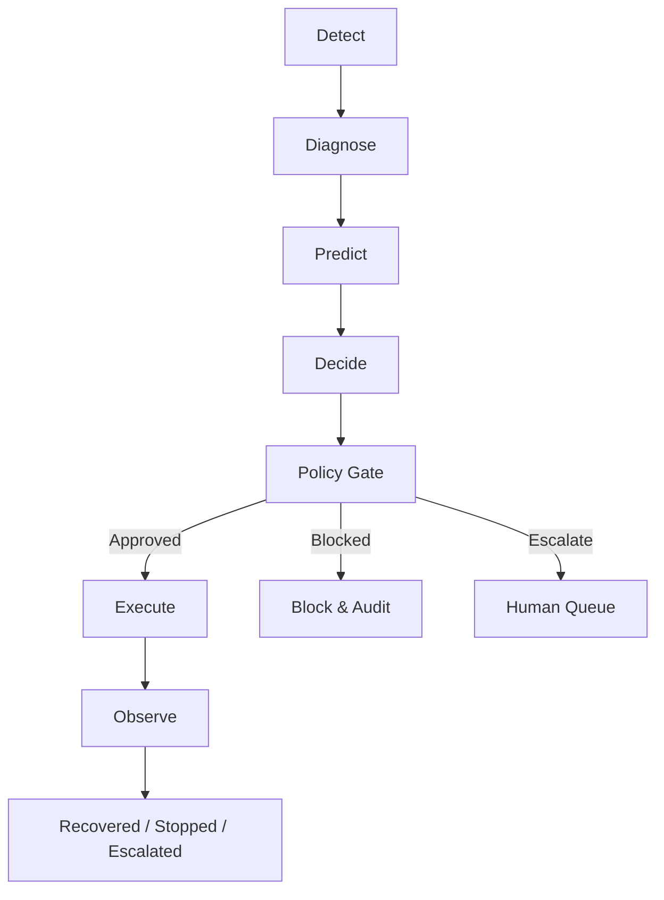
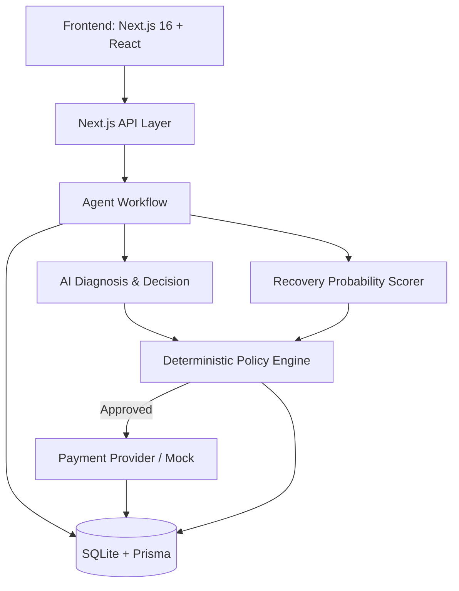
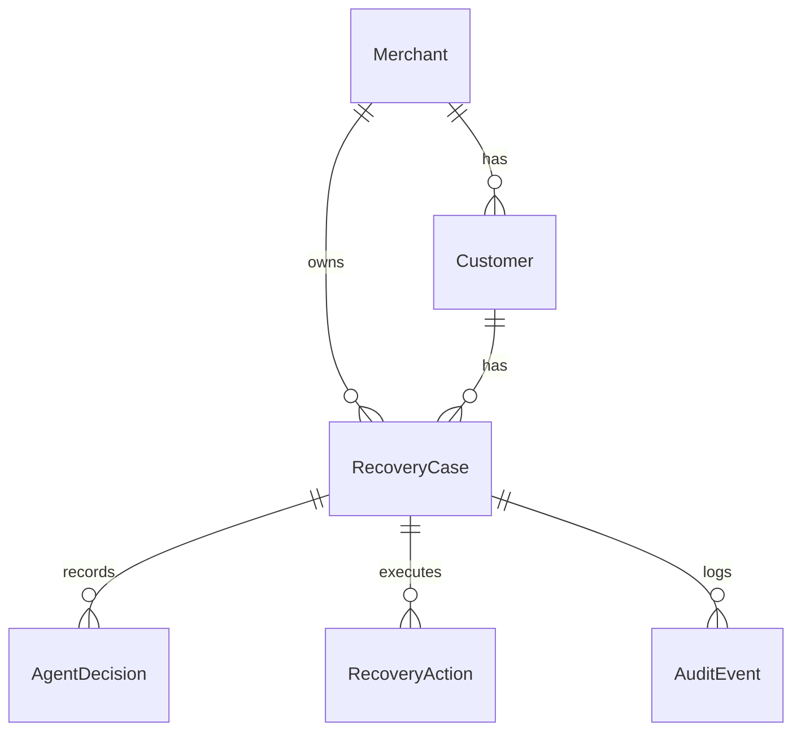

# RevenueRescue AI

Autonomous Revenue Recovery with Bounded AI Decisions

## Overview

Revenue leakage does not occur through one failure mode. Payments fail, subscriptions degrade, checkouts are abandoned, invoices become overdue, and merchants lose recoverable revenue. 

RevenueRescue AI closes this loop through a deterministic, auditable workflow:

Detect → Diagnose → Predict → Decide → Policy Gate → Execute → Observe

AI recommends and assists with decisions by diagnosing root causes and predicting recovery probabilities. However, strict deterministic controls and policy limits exclusively govern financial actions. RevenueRescue AI never allows an LLM to directly execute a payment or financial API.

## Why This Fits Razorpay AI Buildathon — Track 03

This project was built for the Razorpay AI Buildathon 2026, targeting Track 03 — AI Revenue Recovery.

The implementation maps directly to the official track requirements:

1. **Revenue-at-risk detection**: Identifies failed payments and abandoned checkouts.
2. **Root-cause diagnosis**: AI-driven analysis of failure reasons.
3. **Recovery probability estimation**: Logistic-regression-style scoring of case recovery likelihood.
4. **Intervention selection**: Recommends the optimal recovery action (e.g., retry, email reminder).
5. **Deterministic policy gating**: 7 firm business rules that block or escalate actions.
6. **Bounded execution**: Safely executes via Razorpay Test Mode or a deterministic mock provider.
7. **Outcome observation**: Records the result of the executed action.
8. **Recovery measurement**: Tracks actual revenue recovered vs. at risk.
9. **Auditability**: Maintains an immutable timeline of every event and decision.
10. **Safe escalation/stopping rules**: Prevents infinite loops and auto-escalates high-value cases.

## The Core Problem

Simply detecting a failed payment is insufficient for recovery. Merchants need to know *why* it failed, *whether* it can be recovered, and *what* action to take. 

RevenueRescue AI handles this flow:

Payment failure → revenue becomes at risk → identify why → estimate probability of recovery → choose intervention → enforce policy → execute bounded action → observe result → record recovered revenue.

## Product Workflow



## Architecture



The AI is used for diagnosis and action recommendation. Deterministic controls are used for policy gating, execution, and state management.

## AI Architecture

- **Provider**: Gemini (via OpenAI-compatible API endpoints).
- **Responsibility**: Parses failure context, diagnoses root causes, and recommends an initial recovery action.
- **Deterministic Fallback**: If the AI is unavailable or times out, a hardcoded fallback diagnoses the issue and recommends a conservative action (e.g., escalate).
- **Validation**: AI outputs are strictly parsed and validated against predefined ActionType enums.
- **Safety Boundary**: The AI cannot execute financial transactions. It outputs a recommendation which is then passed to the deterministic Policy Engine.

## Safety Model

**AI recommendation → deterministic policy validation → bounded action → execution → audit**

Critical guarantee: **LLM → direct payment API is NOT allowed.**
Instead: **LLM → Recommendation → Policy Engine → Bounded Action → Payment Provider**

Safety features implemented:
- **Retry limits**: Maximum attempts are capped.
- **Stopping rules**: Cases are marked as STOPPED or BLOCKED to prevent infinite loops.
- **Escalation**: High-value cases are automatically routed to human review.
- **Customer opt-out**: Marketing actions are blocked for opted-out customers.
- **Suspicious transaction handling**: Flags and blocks potential fraud.
- **Idempotency & Duplicate handling**: Prevents duplicate events from triggering duplicate financial actions.
- **Payment timeout handling**: Safely marks actions as failed without retrying blindly.

## Database Architecture

The application is built on **SQLite** using **Prisma ORM**.



- **Merchant**: Business entity.
- **Customer**: End-user with lifetime value and opt-out preferences.
- **RecoveryCase**: The core entity tracking revenue at risk, current status (OPEN, IN_PROGRESS, RECOVERED, FAILED, ESCALATED, STOPPED, BLOCKED), and amounts.
- **AgentDecision**: Immutable record of the AI/Agent recommendation and policy decision.
- **RecoveryAction**: The execution record of the selected intervention.
- **AuditEvent**: Complete timeline logging for traceability.
- **PolicyRule**: Configurable rules enforced by the Policy Engine.

Configuration uses `DATABASE_URL="file:./prisma/dev.db"`. Migrations and seed data generate 1,000 synthetic cases for evaluation.

## API Architecture

| Method | Endpoint | Purpose |
|---|---|---|
| GET | `/api/dashboard` | Fetches aggregate metrics (at-risk, recovered, recovery rate) |
| GET | `/api/recovery-cases` | Lists cases with filtering and pagination |
| GET | `/api/recovery-cases/[id]` | Fetches detailed context, timeline, and actions for a specific case |
| POST | `/api/recovery-cases/[id]/recover` | Triggers the agent workflow for a specific case |
| POST | `/api/recovery-cases/[id]/escalate` | Manually escalates a case |
| GET | `/api/audit-events` | Fetches system-wide audit events |
| GET/PUT | `/api/policies` | Fetches and updates Policy Engine configurations |
| GET | `/api/simulations` | Lists batch simulation runs |
| POST | `/api/simulations/[id]` | Executes a batch simulation run |

## Revenue Recovery Logic

The recovery probability is calculated using a deterministic scoring algorithm (logistic-regression style). 
Features include:
- Failure reason (High impact)
- Customer historical success rate (Medium impact)
- Transaction amount (Negative impact)
- Retry count (Negative impact)
- Suspicious flag (Strong negative impact)

It outputs a probability `[0.0, 1.0]` and a confidence level (`LOW`, `MEDIUM`, `HIGH`) with explainability factors.

## Policy Engine

The Policy Engine evaluates agent recommendations against 7 configurable rules:

1. **MAX_RETRY_ATTEMPTS**: Caps payment retries (default: 2).
2. **HIGH_VALUE_THRESHOLD**: Requires human approval for actions above this amount.
3. **MIN_RECOVERY_PROBABILITY**: Blocks actions if probability is below threshold (default: 20%).
4. **MAX_DAILY_CONTACTS**: Limits customer communications per day.
5. **SUSPICIOUS_AUTO_BLOCK**: Auto-blocks recovery for flagged transactions.
6. **RESPECT_OPT_OUT**: Prevents contact actions for opted-out customers.
7. **MAX_ESCALATION_VALUE**: Auto-escalates cases above a massive threshold.

## Reliability Lab

The Reliability Lab allows manual injection of failure states to demonstrate system resilience and safety guarantees.

- **AI_UNAVAILABLE**: Simulates an API outage. The system falls back to a deterministic path safely.
- **INVALID_AI_RESPONSE**: Simulates a hallucination. The system rejects the payload and aborts/escalates.
- **PAYMENT_TIMEOUT**: Simulates a provider timeout. The action is marked pending/failed safely without blind retries.
- **DUPLICATE_EVENT**: Simulates webhook spam. The system idempotently drops duplicate triggers.
- **SUSPICIOUS_TRANSACTION**: Injects fraud flags to demonstrate auto-blocking.

## Decision Graph

An interactive UI component detailing the lifecycle of a single recovery case. Selecting a stage (Detect, Diagnose, Predict, Decide, Policy Gate, Execute, Observe) reveals the exact data payload, JSON context, AI prompt output, and policy evaluations that occurred at that specific moment in time.

## Investigation Timeline

A chronological audit trail derived directly from `AuditEvent` records. It provides traceability, explainability, and compliance visibility for all system actions, ensuring a transparent history of financial operations and AI decisions.

## Batch Evaluation and Results

The project uses a synthetic data pipeline (`prisma/seed.ts`) to evaluate recovery across a batch of 1,000 cases. 

Results from a 1,000-case synthetic batch:
- Total revenue at risk: ₹281.61L
- Total recovered: ₹42.47L
- Recovery rate: 15.1%
- Cases recovered: 347
- Cases stopped: 368
- Cases escalated: 44
- Cases blocked: 38

This demonstrates the system's ability to measure actual recovered money across a realistic cohort, adhering to the Track 03 evaluation bar.

## Demo Flow

1. **0:00–0:30**: Outline the problem of revenue leakage and the agentic solution.
2. **0:30–1:15**: Navigate to the Dashboard. Review aggregate revenue at risk, recovered revenue, and active cases.
3. **1:15–2:15**: Open a failed payment case. Walk through the Detect → Diagnose → Predict → Decide lifecycle. Show the explainable recovery score.
4. **2:15–3:00**: Open the Decision Graph tab. Highlight the Policy Gate node to prove deterministic bounding of AI decisions.
5. **3:00–3:45**: Open the Timeline tab. Showcase the complete, immutable audit trail.
6. **3:45–4:30**: Open the Reliability Lab. Inject an `AI_UNAVAILABLE` or `DUPLICATE_EVENT` failure to demonstrate safe fallbacks and idempotency.
7. **4:30–5:00**: Summarize batch metrics (recovery rate, blocked cases) proving measured, compliant recovery at scale.

## Local Development

```bash
# 1. Clone the repository
git clone <repo>
cd revenue-rescue-ai

# 2. Install dependencies
npm install

# 3. Configure environment variables
cp .env.example .env.local

# 4. Apply the SQLite schema
npm run db:push

# 5. Seed the database with 1,000 synthetic cases
npm run db:seed

# 6. Start the development server
npm run dev
```

## Environment Variables

| Variable | Required | Purpose |
|---|---|---|
| `DATABASE_URL` | ✅ | SQLite connection string (`file:./prisma/dev.db`) |
| `GEMINI_API_KEY` | ❌ | API key for Gemini models |
| `AI_BASE_URL` | ❌ | Custom base URL for OpenAI-compatible endpoints |
| `AI_MODEL` | ❌ | Model identifier |
| `PAYMENT_PROVIDER` | ❌ | `razorpay` or `mock` (defaults to mock) |
| `RAZORPAY_KEY_ID` | ❌ | Razorpay Test Key ID |
| `RAZORPAY_KEY_SECRET`| ❌ | Razorpay Test Key Secret |
| `NEXT_PUBLIC_DEMO_MODE`| ❌ | Enables UI demo features like Reliability Lab |
| `NEXT_PUBLIC_APP_NAME`| ❌ | App display name |

## Testing

The project maintains a comprehensive testing suite for policy rules, recovery scoring, and accounting logic.

```bash
npm run lint          # Run ESLint
npx tsc --noEmit      # Run TypeScript typechecking
npm run build         # Verify production build
npx tsx tests/comprehensive.test.ts # Run the core business logic test suite
```

## Project Structure

```
revenue-rescue-ai/
├── app/                  # Next.js 16 App Router UI & API Routes
├── components/           # Reusable React components
├── docs/                 # Extended documentation
├── lib/                  # Core business logic
│   ├── agent/            # Workflow, Policy Engine, AI Diagnosis
│   ├── db/               # Prisma client instantiation
│   ├── providers/        # Payment providers (Mock / Razorpay)
│   └── utils/            # Accounting & Logging utilities
├── prisma/               # Schema and Database seeding
└── tests/                # Core test suites
```

## Design Decisions

1. **Deterministic Policy Controls**: Financial safety is paramount. The LLM cannot be fully trusted with unbounded execution.
2. **AI Action Isolation**: The AI is restricted to analytical diagnosis and bounded recommendations, leaving execution to hardcoded provider implementations.
3. **First-Class Audit Events**: Every state change emits an audit log for full compliance and debuggability.
4. **Failure Injection**: Proves system safety and idempotency, which is critical for fintech applications.
5. **Synthetic Batch Evaluation**: Demonstrates scale and statistical recovery metrics rather than anecdotal single-case successes.
6. **Bounded Recovery**: It is safer to escalate or stop recovery than to aggressively retry and alienate the customer or incur network penalties.

## Limitations

- Data is fully synthetic and generated via a seed script.
- The default payment provider is a deterministic mock. Real-time webhooks are not implemented.
- Authentication and authorization are not implemented in this prototype.
- The recovery probability model uses simplified heuristics rather than a trained neural network.

## Future Work

- Integration with production payment webhooks.
- Multi-merchant isolation and authentication.
- Machine-learning model trained on real historical merchant data.
- Human-in-the-loop interface for reviewing escalations.

## License

MIT License
