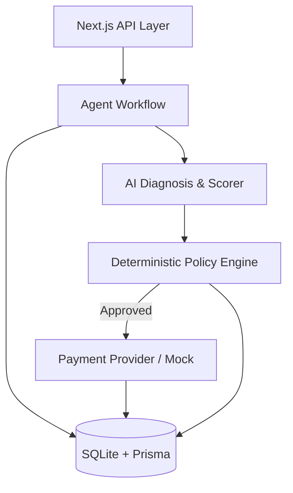

# RevenueRescue AI

Autonomous Revenue Recovery with Bounded AI Decisions

## Overview

Revenue leakage occurs across multiple failure modes: failed payments, degraded subscriptions, and abandoned checkouts. RevenueRescue AI is an autonomous agent that detects these failures, diagnoses root causes, estimates recovery probability, and executes policy-bounded recovery actions. 

The system isolates AI recommendations from financial execution. AI assists with diagnosis, but strict deterministic rules exclusively govern all financial operations.

## Core Features

- **Revenue-at-Risk Detection**: Identifies failed payments and abandoned checkouts.
- **AI Diagnosis**: Analyzes failure contexts with a deterministic fallback if the AI is unavailable.
- **Recovery Probability**: Uses deterministic scoring to estimate recovery likelihood.
- **Policy-Controlled Recovery**: Evaluates actions against 7 firm business rules before execution.
- **Audit Trail**: Maintains an immutable timeline of every system event and decision.
- **Interactive Decision Graph**: Visualizes the lifecycle of a recovery case step-by-step.
- **Reliability Lab**: A failure injection suite to test system resilience.

## Architecture



## Tech Stack

- **Frontend**: Next.js 16, TypeScript, Tailwind CSS, Recharts
- **Backend**: Next.js API Routes
- **Database**: SQLite, Prisma ORM
- **AI**: Gemini via OpenAI-compatible endpoints
- **Payments**: Razorpay Test Mode / Deterministic Mock Provider

## AI and Safety Architecture

The AI strictly diagnoses failures and recommends an initial recovery action. It cannot execute transactions. 

The Safety Model guarantees:
**AI recommendation -> deterministic policy validation -> bounded action -> execution -> audit**

If the AI API fails, times out, or hallucinates, a hardcoded fallback automatically takes over to escalate or safely stop the case. The system enforces idempotency, stopping rules, maximum retries, and high-value escalation thresholds deterministically.

## Database

Built on SQLite using Prisma ORM.

Core Models:
- `Merchant` and `Customer`: Core business entities.
- `RecoveryCase`: Tracks revenue at risk and case status.
- `AgentDecision` and `RecoveryAction`: Immutable records of agent recommendations and executions.
- `AuditEvent`: Complete chronological logging for compliance.

## Setup and Local Development

```bash
git clone <repo>
cd revenue-rescue-ai
npm install

cp .env.example .env.local

npm run db:push
npm run db:seed
npm run dev
```

## Environment Variables

| Variable | Required | Purpose |
|---|---|---|
| `DATABASE_URL` | Yes | SQLite connection string (`file:./prisma/dev.db`) |
| `GEMINI_API_KEY` | No | API key for Gemini models |
| `PAYMENT_PROVIDER` | No | `razorpay` or `mock` (defaults to mock) |
| `NEXT_PUBLIC_DEMO_MODE` | No | Enables UI demo features like Reliability Lab |

## API Endpoints

- `GET /api/dashboard`: Aggregate recovery metrics
- `GET /api/recovery-cases`: Paginated list of cases
- `POST /api/recovery-cases/[id]/recover`: Triggers the agent workflow
- `POST /api/recovery-cases/[id]/escalate`: Manually escalates a case
- `GET /api/audit-events`: System-wide audit logs
- `GET/PUT /api/policies`: Policy Engine configuration

## Testing

The project maintains a comprehensive testing suite for policy rules, recovery scoring, and accounting logic.

```bash
npm run lint          # Run ESLint
npx tsc --noEmit      # Run TypeScript typechecking
npm run build         # Verify production build
npx tsx tests/comprehensive.test.ts # Core business logic test suite
```

## Judge Demo Flow (3 Minutes)

1. **Dashboard (30s)**: View aggregate revenue at risk and recovery rates.
2. **Case Investigation (1m)**: Open a failed payment case. Step through the Decision Graph to see the Detect, Diagnose, Predict, and Decide lifecycle bounded by the Policy Gate.
3. **Audit Trail (45s)**: Open the Timeline tab to show the immutable history of actions.
4. **Resilience Test (45s)**: Open the Reliability Lab. Inject an AI Unavailable or Duplicate Event failure to demonstrate safe fallbacks and idempotency.

## Project Structure

- `app/`: Next.js UI and API Routes
- `lib/agent/`: Core workflow, Policy Engine, AI Diagnosis
- `lib/providers/`: Payment providers
- `prisma/`: Schema and Database seeding
- `tests/`: Core test suites
